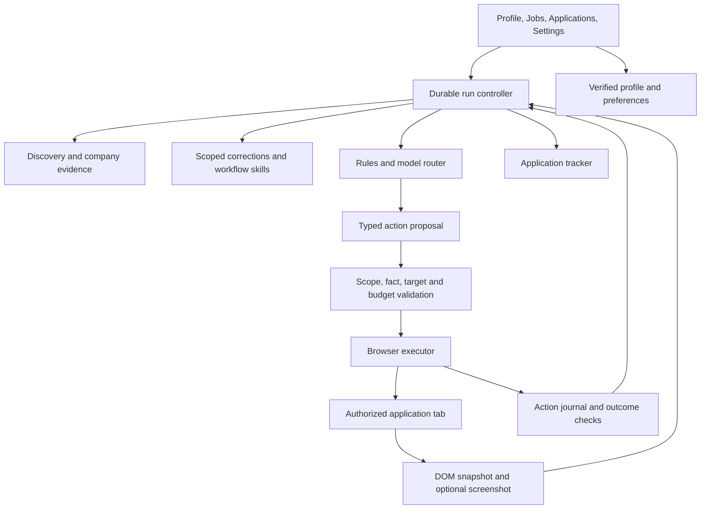
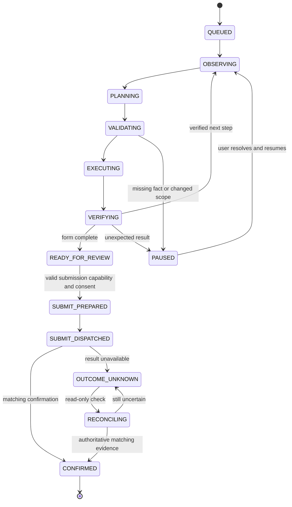

# Proposed application agent architecture

Status: design, not shipped behavior. See the [plan index](./README.md) and [delivery order](./IMPLEMENTATION.md).

## System shape

Keep a modular TypeScript application. Start with the existing Chrome extension and a durable local run store. Add an optional companion only for local inference, large research traces, or a browser backend that cannot run inside the extension. Cloud sync remains optional and is not the automation scheduler.

The model proposes; application code owns authority, browser execution, persistence, and verification. Separate prompts for extraction, classification, drafting, and planning. Do not repurpose the existing grounded-drafting prompt into an unrestricted browser agent.

## Reuse and change points

| Existing location                                                              | Keep                                                | Extend or separate                                                                      |
| ------------------------------------------------------------------------------ | --------------------------------------------------- | --------------------------------------------------------------------------------------- |
| `packages/candidate-schema`, `packages/profile-core`, `packages/resume-parser` | Versioned, sourced, verified facts and local import | Preferences, additional user narratives, freshness, reversible migration                |
| `packages/form-schema`, `packages/form-engine`                                 | Snapshots, deterministic matches, fill planning     | Stable document/control references, custom-control proposals, read-back verification    |
| `packages/question-ontology`, `packages/saved-response-engine`                 | Canonical questions, risk policies, scoped answers  | Correction retrieval and contextual applicability                                       |
| `packages/ai-gateway`, `packages/grounded-generation`                          | Structured output, timeouts, evidence-bound drafts  | Provider capabilities, task routing, token/cost accounting, separate planner contracts  |
| `packages/job-schema`, `packages/application-state`                            | Normalized jobs, tracker, duplicate logic           | Discovery-source identity distinct from destination ATS; uncertain outcomes             |
| `packages/ats-*`, `apps/extension/src/ats-page.ts`                             | Deterministic adapter dispatch and metadata         | Capability descriptors and independently tested workflow drivers                        |
| `packages/browser-command-schema`, `packages/shared`                           | Runtime validation and URL policy                   | New gated commands and explicit run/site capabilities                                   |
| `packages/navigation-core`, `packages/submission-core`                         | Persist-before-dispatch and confirmed outcomes      | Generalized run state in new contracts; retain old restricted behavior during migration |
| `apps/extension/src/background.ts`, `content.ts`                               | Message boundary and browser dispatch               | Move orchestration into testable controller services                                    |
| `apps/extension/src/scanner.ts`, `form-driver.ts`, `upload-driver.ts`          | Existing observation, fill and upload behavior      | Scoped target registry, custom widgets, postconditions                                  |
| `apps/extension/src/sidepanel/main.tsx`                                        | Profile/answer/tracker components                   | Split feature modules and present task-level progress                                   |
| `apps/test-ats`, `evals/end-to-end`                                            | Real Chromium tests and synthetic forms             | Search, review, dialog and multi-step emulations with authoritative state               |

New package names in this plan are proposals: `agent-core`, `discovery-core`, `company-research`, and `feedback-memory`. Extend existing schema and gateway packages rather than create a service for every task. Optional `apps/agent-companion` and `evals/agent` are not present yet.

## Browser access and isolation

Use the extension's explicitly authorized tab and site access. Never enumerate all logged-in accounts or export browser cookies. The user signs in normally and chooses the research/application tab. Bind every run to tab ID, document identity, account context if safely observable, and allowed origin transitions. Changing accounts, job identity, or destination invalidates outstanding plans.

Use existing content scripts for ordinary controls. Evaluate `chrome.debugger` only in a separate opt-in capability for accessibility information or coordinate input. It requires additional permission and a visible browser attachment; do not require it for the basic product. Screenshot-based interaction must use a fresh viewport and stop if focus, scroll, zoom, target document, or layout changed.

Prefer element references derived from a current observation. The executor creates opaque, short-lived `targetRef` values. Models do not provide arbitrary selectors, JavaScript, shell commands, filesystem paths, network endpoints, or file contents. A vision model may nominate a location; the executor grounds it to the current permitted viewport/control before dispatch. Ambiguous grounding pauses the run.

Background DOM work may run while another tab is active, subject to page behavior and browser throttling. Vision or focus-sensitive interactions may require an active dedicated tab. Pause when the user takes over. Do not advertise invisible operation on every website or completion while Chrome is closed.

If a companion is justified, prefer Chrome native messaging with an allowlisted extension ID and a versioned schema; the companion calls loopback inference. Native messaging uses a process channel, not HTTP Origin/Host headers. A direct extension-to-local-runtime connection is an alternative requiring exact extension-origin configuration. Any HTTP/WebSocket bridge additionally needs authentication, Origin/Host checks, payload limits, and rejection of wildcard origins and arbitrary proxying. Keep local inference on loopback and bind credentials to the intended provider so redirects cannot forward them elsewhere. No debug port on a public interface.

Native host-to-extension messages have a 1 MB limit; use small metadata messages, bounded chunks or opaque local artifact handles for larger results. An artifact handle must resolve only within the approved run's private artifact store, never an arbitrary filesystem path. See the native messaging source below.

Browser lifecycle and APIs: [extension service workers](https://developer.chrome.com/docs/extensions/develop/concepts/service-workers/lifecycle), [debugger API](https://developer.chrome.com/docs/extensions/reference/api/debugger), [native messaging](https://developer.chrome.com/docs/extensions/develop/concepts/native-messaging).

## Data contracts to implement

All new records need Zod schemas, `schemaVersion`, migration tests, bounded lengths, and explicit ownership. Hashes and opaque IDs are not anonymization; keep personal records private.

| Record                               | Required concepts                                                                                                                          |
| ------------------------------------ | ------------------------------------------------------------------------------------------------------------------------------------------ |
| `SearchPreferences`                  | Roles, skill interests, locations, remote policy, compensation amount/currency/period, notice period, exclusions, verification and expiry  |
| `DiscoveryRecord`                    | Source ID, source job ID, original and canonical URLs, destination ATS, extracted fields, provenance, observed time, expiry, availability  |
| `CompanyEvidence`                    | Resolved employer entity, source URL, permitted short evidence, rating scale/count/date, geography, confidence and conflicts               |
| `AgentRun`                           | Run/job/profile revision, mode, granted capabilities, document binding, state, budget, lease owner, journal revision, pause reason         |
| `Observation`                        | ID, tab/frame/document, URL, timestamp, page fingerprint, visible control refs, form state, optional redacted image handle                 |
| `ActionProposal`                     | Run/observation IDs, permitted action kind, target ref, answer/fact refs, expected postcondition, rationale summary, expiry                |
| `ApplicationConsent`                 | Chosen job and destination, profile/resume revision, reviewed answer digest, allowed actions, explicit submission scope, expiry/revocation |
| `ActionEvent`                        | Sequence, intent ID, before/after fingerprints, dispatch state, validated outcome code, latency and model usage; no raw secret values      |
| `CorrectionRecord` / `WorkflowSkill` | See [learning design](./LEARNING_AND_EVALUATION.md); facts and procedural lessons remain separate                                          |

Resolve actual candidate values inside the executor or narrowly scoped drafting task, not by placing the whole profile into every planning prompt. Generative answers must reference evidence and remain unverified until reviewed. A site's demand for an answer does not make that answer true.

## Controller state and recovery

Any active state can also terminate as `CANCELLED` or `FAILED`; an access challenge pauses with a typed reason. Cancellation prevents new dispatches; it cannot undo a request already accepted by an employer.

Store runs and their append-only event journals transactionally in IndexedDB. Retain current profile/tracker stores initially and use an idempotent outbox event to update them. This avoids claiming cross-store atomicity. Worker restarts recover from the durable journal, re-observe the page, and revalidate consent before continuing. Never rely solely on an in-memory map or service-worker timers.

Use one writer lease per application and per tab, with a monotonically increasing fencing token. Persist a per-intent dispatch claim transactionally and validate the current token immediately before execution; the receiver also deduplicates intent IDs and rejects delayed commands from expired owners. A lease alone cannot prevent an old worker's message from arriving late. Discovery tasks may run concurrently within source budgets; application mutations are serialized. Duplicate detection blocks ambiguous job identity before dispatch. Cross-device submission is out of initial scope; optional sync must not replay browser actions.

Each mutation persists an intent before sending it. For ordinary fills, recovery first checks whether the intended value already exists; retry only when safe and the postcondition proves no conflicting user change. Navigation retries require evidence of no transition and a fresh plan. **Submission is never blindly retried.** Persist `SUBMIT_DISPATCHED` before the click; a lost response becomes `OUTCOME_UNKNOWN`, reconciled by reading history/confirmation or by the user.

This provides at-most-once dispatch within the controller's supported failure model, not guaranteed exactly-once delivery to an arbitrary website. Tests must cover a crash between intent persistence and dispatch, between dispatch and response, and between confirmation and tracker update.

`OUTCOME_UNKNOWN` and `RECONCILING` prohibit further submission mutations. Reconciliation can read matching confirmation/history evidence and emit the idempotent tracker event, or remain uncertain; it cannot restart the Apply workflow automatically. A user-reported outcome is labeled separately from browser-verified evidence.

## Scope of one-click application

Prepare a job-level review bundle containing employer/job identity, destination, resume checksum, confirmed facts, reviewed narratives, exclusions, and expected workflow. A user action can authorize routine filling and supported navigation for that job. A future live submission capability may consume the same authorization only when it explicitly included submission and every answer/declaration is covered.

New questions, changed pay units, new legal declarations, profile edits, account changes, or destination changes invalidate affected consent. Batch unknowns into one useful clarification screen; do not silently guess them to preserve a one-click metric. In preparation-only mode the outcome is `READY_FOR_REVIEW`, never `APPLIED`.

Uploaded files are selected and bound to an approved file ID and checksum. Current raw resume import is transient; do not claim the imported file can later be uploaded automatically. Initially request the file once per application session. An optional future encrypted document vault requires its own retention and migration design.

## Observation, action, verification loop

1. Observe visible DOM, labels, options, current values, validation messages, and workflow indicators.
2. Retrieve applicable verified facts, scoped answers, corrections, and a small number of active workflow skills.
3. Attempt deterministic mapping; use a small structured model only for unresolved interpretation.
4. Use vision only if observation cannot identify the control and the run has that capability.
5. Validate target identity, source permissions, profile revision, action budget, protected fields, and consent.
6. Execute one action or a bounded group of independent fills in the same unchanged document.
7. Read back values and application state. Record mismatches, not just successful DOM event dispatch.
8. Continue, request clarification, or stop with an actionable explanation.

A numeric model confidence is not a permission check. Calibrate thresholds from held-out data and keep protected-field rules independent of model confidence. No second model is a substitute for a browser-state assertion.

## Data and release controls

Keep profile facts, answer memory, raw observations, and redacted metrics in separate stores. Raw screenshots and free-text traces are session-only by default; research export requires preview and explicit selection. Suggested research-artifact retention is seven days, configurable down to immediate deletion. Delete derived indexes when deleting memory. Do not sync new memories/traces automatically through the existing sync schema.

For hosted inference, disclose the exact data categories sent and select only the needed fields. Keys remain provider-scoped session secrets. Exclude them from prompts, logs, backups, screenshots, and training examples. Research uses synthetic data until private-data handling is tested.

Introduce separate compile-time and runtime gates for the experimental controller, vision, local provider, and future submission. Exact local emulation routes may be enabled in a research build; domain lookalikes, redirects, cross-origin frames, and page-supplied markers cannot grant authority. Existing production defaults stay intact until the relevant implementation/release work package is complete.

## Build-versus-adopt decisions

Use existing Playwright tests as the first harness. Compare Stagehand and Browser Use behind the same executor interface in an isolated spike; evaluate action verification, Chrome-session integration, observability, license, telemetry, dependency size, and Windows installation. Do not import an entire agent framework simply for its branding or built-in cloud service.

Keep the initial scheduler local and persistent. Defer a distributed workflow service, vector database service, graph database, and multi-agent browser swarm until measured scale requires them. A planner, executor, and verifier are responsibilities; they do not require three paid model calls per step. See [research decisions](./RESEARCH.md).
